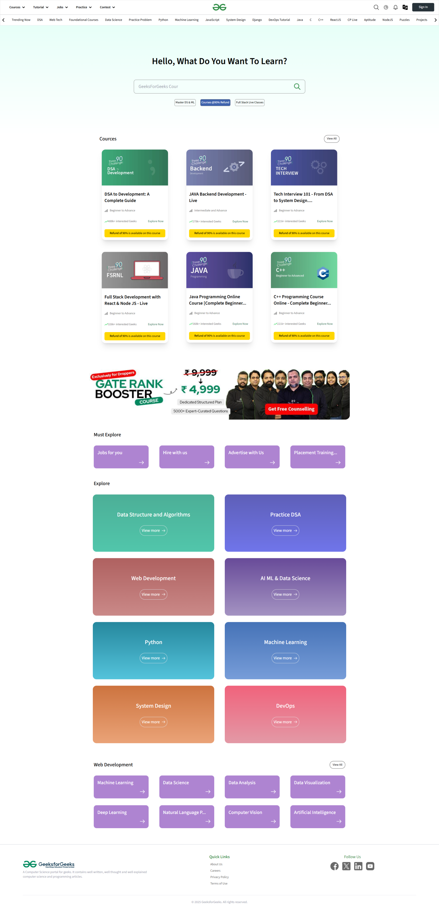

# GeeksforGeeks Clone 🖥️

## This is a fully responsive clone of the GeeksforGeeks website, built using React. The project replicates the UI and functionality of the original site, providing an interactive and seamless user experience.

✔️ Modern UI inspired by GeeksforGeeks
✔️ Dynamic search animation
✔️ Reusable components for scalability

🔧 Tech Stack
React (for UI components)
Tailwind CSS (for styling)
React Router (for navigation)

